<div align="center">

<br/>

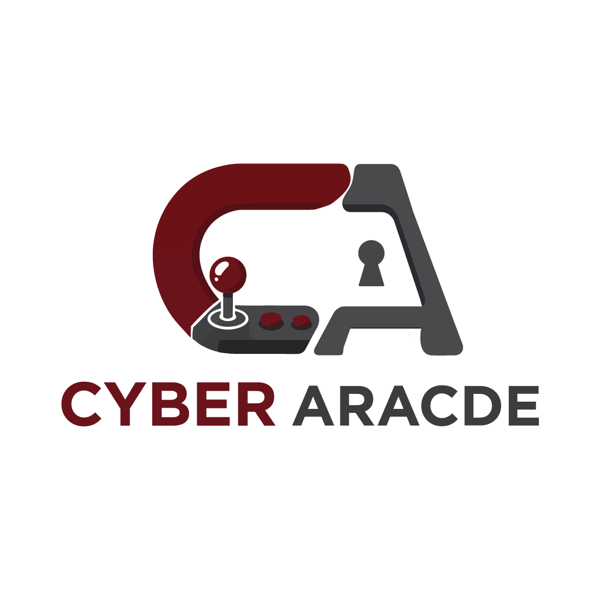

<h1>CyberArcade</h1>

<p><strong>AI-Powered Cybersecurity Training Platform</strong></p>

<p><em>Learn. Practice. Validate.</em></p>

<br/><br/>

<!-- TECH STACK BADGES -->
[](https://python.org)
[](https://fastapi.tiangolo.com)
[](https://reactjs.org)
[](https://docker.com)
[](https://postgresql.org)

<!-- STATUS BADGES -->
[](https://github.com/Mido-ahmed586/cyberarcade/actions/workflows/ci.yml)
[](https://github.com/Mido-ahmed586/cyberarcade/actions/workflows/security-scan.yml)
[](LICENSE)

<!-- COMMUNITY BADGES -->
[](https://github.com/Mido-ahmed586/cyberarcade/stargazers)
[](https://github.com/Mido-ahmed586/cyberarcade/issues)
[](https://github.com/Mido-ahmed586/cyberarcade/graphs/contributors)

<br/>

[Run Locally](#getting-started) · [Documentation](docs/README.md) · [Report Bug](https://github.com/Mido-ahmed586/cyberarcade/issues/new?template=bug_report.yml) · [Request Feature](https://github.com/Mido-ahmed586/cyberarcade/issues/new?template=feature_request.yml)

</div>

---

## Table of Contents

- [Overview](#overview)
- [Key Features](#key-features)
- [Screenshots](#screenshots)
- [Documentation](docs/README.md)
- [Architecture](#architecture)
- [Technology Stack](#technology-stack)
- [Getting Started](#getting-started)
- [Configuration](#configuration)
- [API Reference](#api-reference)
- [Lab Scenarios](#lab-scenarios)
- [Security](#security)
- [Roadmap](#roadmap)
- [Contributing](#contributing)
- [Team](#team)
- [License](#license)

---

## Overview

**CyberArcade** is a full-stack, browser-based cybersecurity training platform built to bridge the gap between theoretical security education and real-world offensive and defensive skills.

Students access **fully isolated Docker lab environments** directly in the browser — no VPN, no VM setup, no configuration. Each lab spins up real attack and victim containers (Kali Linux, Metasploitable2, custom targets) orchestrated entirely through the backend. An **AI-powered assistant** provides contextual guidance, time-gated hints nudge learners toward discovery rather than giving answers away, and an automated solver validates expected outcomes.

Instructors manage classrooms, track student progress, and publish content through a dedicated dashboard. Administrators oversee subscriptions, user management, and platform-wide analytics.

> CyberArcade is designed for universities, cybersecurity bootcamps, corporate security teams, and self-learners who want hands-on experience in a safe, legal, and controlled environment.

**Platform highlights at a glance:**

| Metric | Value |
|---|---|
| Hands-on Labs | 45+ |
| Lab Scenarios | 4 |
| AI Assistance | Context-aware |
| Supported Roles | Student · Instructor · Admin |
| Container Isolation | Per-lab Docker networks |


## Why CyberArcade?

CyberArcade is built around one goal: **turn cybersecurity theory into repeatable hands-on practice**.

- **Learn → Practice → Validate:** every course connects learning content to practical lab tasks.
- **Real environments:** students work with real security tools and isolated Docker-based targets.
- **Guided, not spoon-fed:** time-gated hints and an AI coach help learners progress without immediately revealing solutions.
- **Built for educators:** instructors can manage classrooms, assign training, and track progress.
- **Safe by design:** labs are isolated and intended for controlled, authorized training environments.

---

## Key Features

### Practical Learning Infrastructure

**Browser-Based Lab Terminals**
Full Kali Linux and target machine access rendered directly in the browser via Apache Guacamole. Students interact with real shells — running Nmap, Metasploit, Hydra, and forensics tools — without installing anything locally.

**Docker-Powered Isolated Environments**
Each lab scenario provisions its own isolated Docker network. Attack containers cannot reach the host or other students' environments. Lab stacks are started on demand and torn down after completion.

**Multi-Scenario Lab Library**
- SSH Bruteforce & Defense (dual-container: attacker + target)
- Kali Terminal Sandbox (dual-container interactive environment)
- Digital Forensics Lab (evidence analysis with Sleuth Kit, Volatility3, Binwalk)
- Metasploit & Metasploitable Penetration Testing (full exploitation workflow)

---

### Learning Experience

**Structured Course Catalog**
Courses are organized by category and difficulty level, each containing ordered labs with practical tasks. Students progress through theory and hands-on exercises within a single coherent learning path.

**Time-Gated Hint System**
Hints are unlocked progressively after configurable delay windows. Students are nudged toward discovering answers rather than being handed solutions.

**Automated Lab Solver**
An auto-solve system demonstrates the expected solution for each task — useful for instructors, review sessions, and students who are genuinely stuck.

**AI Cybersecurity Coach**
An integrated AI assistant answers platform-specific and general cybersecurity questions. Context-aware guidance adapts to the current lab and task the student is working on.

---

### Platform Management

**Instructor Dashboard**
Instructors create and manage classrooms, assign courses to students, monitor completion rates, and review individual progress. Content publishing controls are built in.

**Admin Panel**
Full platform administration: user management, subscription plans, course publishing, lab environment health monitoring, and system-wide analytics.

**Gamification & Leaderboards**
Students earn points, unlock badges, and compete on leaderboards. Certificate generation marks course completion.

**Subscription Management**
Tiered subscription plans control access to advanced courses and lab environments. Built-in plan management and upgrade flows.

---

## Screenshots

> Screenshots below highlight the main student, instructor, AI, and administration workflows.

<table>
  <tr>
    <td align="center">
      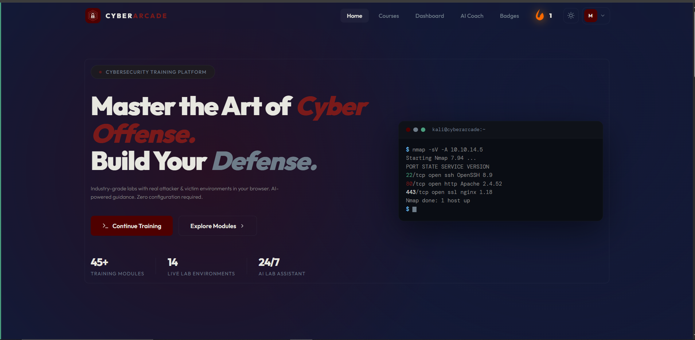
      <br/><sub><b>Landing Page</b></sub>
    </td>
    <td align="center">
      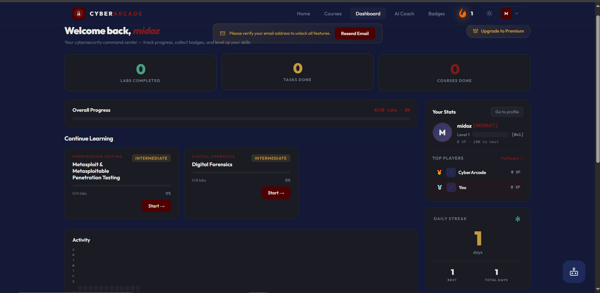
      <br/><sub><b>Student Dashboard</b></sub>
    </td>
  </tr>
  <tr>
    <td align="center">
      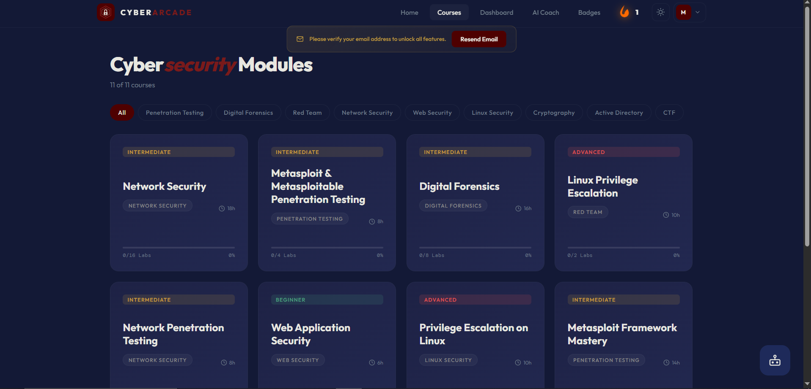
      <br/><sub><b>Course Catalog</b></sub>
    </td>
    <td align="center">
      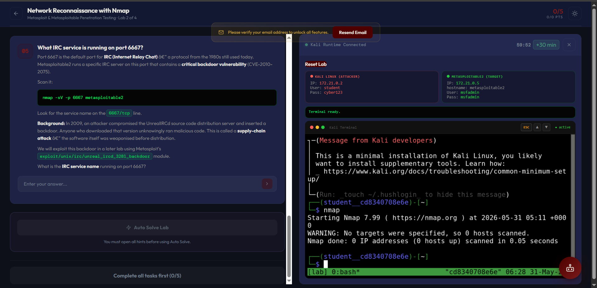
      <br/><sub><b>Live Lab Terminal</b></sub>
    </td>
  </tr>
  <tr>
    <td align="center">
      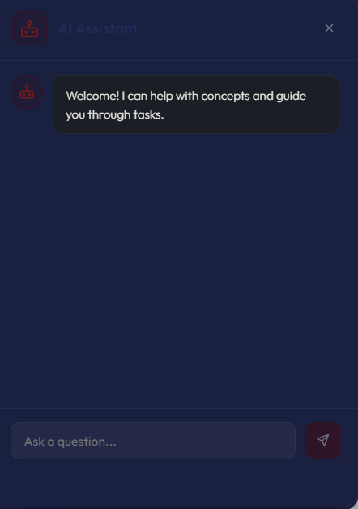
      <br/><sub><b>AI Cybersecurity Coach</b></sub>
    </td>
    <td align="center">
      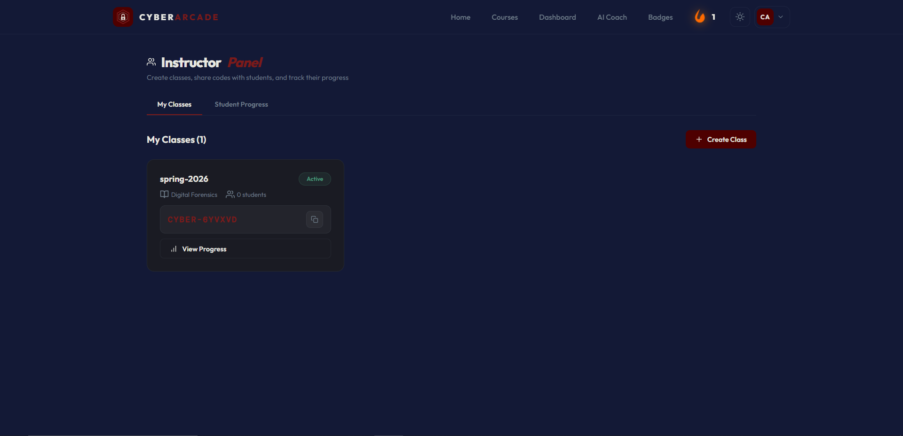
      <br/><sub><b>Instructor Dashboard</b></sub>
    </td>
  </tr>
  <tr>
    <td align="center" colspan="2">
      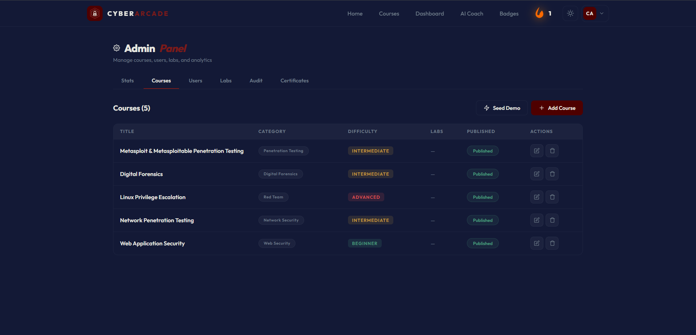
      <br/><sub><b>Admin Panel</b></sub>
    </td>
  </tr>
</table>


---

## Documentation

The repository includes focused documentation for setup and extending the training labs.

| Guide | Description |
|---|---|
| [Deployment Guide](docs/deployment/README.md) | Docker, Ubuntu Server, reverse proxy, and production deployment |
| [Lab Development Guide](docs/labs/README.md) | Structure and workflow for creating new lab scenarios |

For API exploration during local development, open FastAPI Swagger UI at http://localhost:8000/docs.

---

## Architecture

### High-Level System Architecture

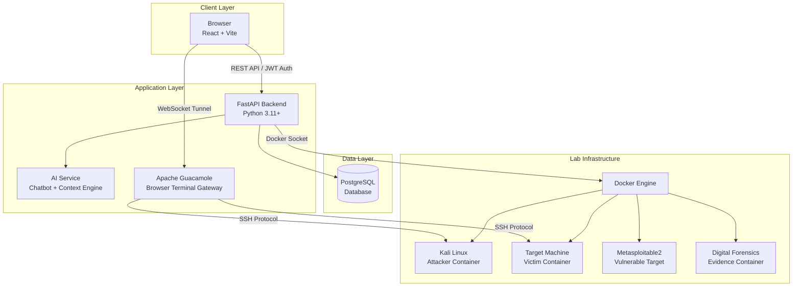

---

### Deployment Architecture

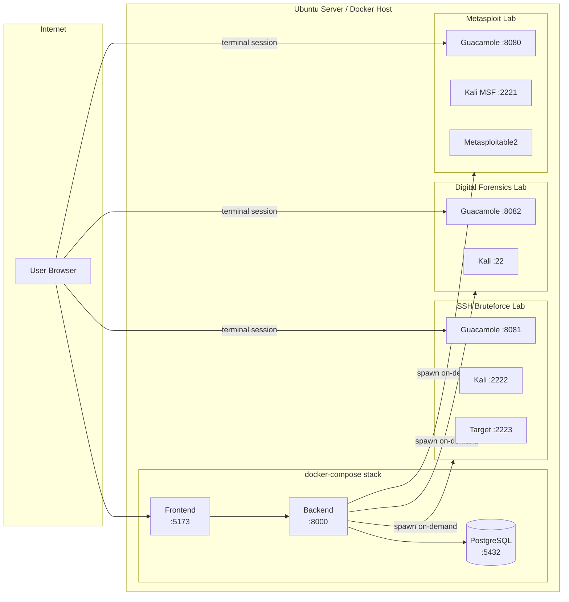

---

### Student Learning Workflow

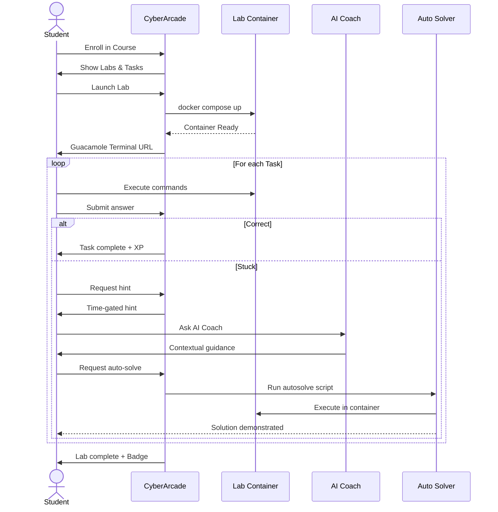

---

## Technology Stack

| Layer | Technology | Purpose |
|---|---|---|
| **Frontend** | React 18 + Vite | SPA — courses, labs, dashboard, AI chat |
| **Backend** | FastAPI + Python 3.11 | REST API, JWT auth, lab orchestration |
| **Database** | PostgreSQL 15 | Users, courses, labs, progress, subscriptions |
| **Container Runtime** | Docker + Docker Compose | Lab environment lifecycle management |
| **Terminal Gateway** | Apache Guacamole | Browser-to-SSH terminal proxying |
| **Authentication** | JWT (HS256) | Stateless auth with role-based access |
| **Lab Targets** | Kali Linux, Metasploitable2, custom | Real attack/defense environments |
| **AI Service** | Integrated chatbot | Context-aware lab assistance |
| **Migrations** | Alembic | Schema version control |
| **Package Mgr** | Poetry / pip | Python dependency management |

---

## Getting Started

### Prerequisites

| Requirement | Version | Notes |
|---|---|---|
| Docker Desktop | 24.0+ | Required for all lab scenarios |
| Docker Compose | v2 (plugin) | Bundled with Docker Desktop |
| Git | Any | |
| Node.js | 18+ | Frontend development only |
| Python | 3.11+ | Backend development only |

---

### Option A — Full Docker Deployment (Recommended)

The fastest way to run the complete platform including all lab scenarios.

```bash
# 1. Clone the repository
git clone https://github.com/Mido-ahmed586/cyberarcade.git
cd cyberarcade

# 2. Copy environment file and configure secrets
cp .env.example .env
# Edit .env — set your SECRET_KEY, database password, etc.

# 3. Start the main stack (backend + frontend + database)
docker compose up -d --build

# 4. Seed the database with courses and default admin
docker compose exec backend python seeds/seed_all.py

# 5. Open the platform
#    Frontend:  http://localhost:5173
#    Backend:   http://localhost:8000/docs
#    Admin:     use the CYBERARCADE_ADMIN_EMAIL / CYBERARCADE_ADMIN_PASSWORD values from your local .env
```

> **First run note:** The initial build downloads base images (~4–5 GB) and compiles frontend dependencies. Allow 10–20 minutes on first run depending on internet speed.

---

### Option B — Local Development

Run backend and frontend separately for hot-reload development.

**Backend**

```bash
cd Backend/Backend/cyberarcade-backend

# Install dependencies
pip install -r requirements.txt
# or: poetry install

# Configure environment
cp .env.example .env

# Apply database schema
alembic stamp head

# Seed initial data
python seeds/seed_all.py

# Start development server
uvicorn app.main:app --reload --host 0.0.0.0 --port 8000
```

**Frontend**

```bash
cd Frontend/Frontend/cyberarcade

# Install dependencies
npm install

# Start Vite dev server
npm run dev
# → http://localhost:5173
```

---

### Starting Lab Scenarios

Lab containers are started on demand when a student launches a lab. You can also start them manually for testing:

```bash
# SSH Bruteforce & Defense lab
cd scenarios/ssh-bruteforce-defense
docker compose up -d --build

# Digital Forensics / Kali Terminal lab
cd scenarios/kali-terminal
docker compose up -d --build

# Metasploit & Metasploitable2 lab
cd scenarios/metasploit-basics
docker compose up -d --build

# df-kali standalone lab
cd scenarios/df-kali
docker compose up -d --build
```

---

### Lab Credentials

The training labs use intentionally weak, isolated credentials for educational scenarios. These values are part of the lab exercises and must never be reused outside the local training environment.

| Service | Credentials |
|---|---|
| Guacamole lab | `guacadmin` / `guacadmin` |
| Lab SSH | `student` / `student123` |

> These credentials are for local lab containers only and must never be reused in production.

---

## Configuration

Copy `.env.example` to `.env` and set the following variables:

```env
# ─── Application ────────────────────────────────────────
CYBERARCADE_ADMIN_EMAIL=admin@example.com
CYBERARCADE_ADMIN_PASSWORD=replace-with-a-strong-password
SECRET_KEY=generate-a-long-random-secret
ALGORITHM=HS256
ACCESS_TOKEN_EXPIRE_MINUTES=30
REFRESH_TOKEN_EXPIRE_DAYS=7

# ─── Database ───────────────────────────────────────────
POSTGRES_USER=cyberarcade_admin
POSTGRES_PASSWORD=replace-with-a-strong-database-password

# ─── AI Service ─────────────────────────────────────────
GROQ_API_KEY=your-groq-api-key

# ─── Email (optional) ─────────────────────────────────
SMTP_HOST=smtp.gmail.com
SMTP_PORT=587
SMTP_USER=your-email@gmail.com
SMTP_PASSWORD=your-gmail-app-password
SMTP_FROM=CyberArcade <your-email@gmail.com>

# ─── Google OAuth (optional) ──────────────────────────
GOOGLE_CLIENT_ID=your-client-id
GOOGLE_CLIENT_SECRET=your-client-secret
```

---

## API Reference

Interactive API documentation is auto-generated by FastAPI:

| Interface | URL | Description |
|---|---|---|
| **Swagger UI** | `http://localhost:8000/docs` | Interactive API explorer |
| **ReDoc** | `http://localhost:8000/redoc` | Clean reference documentation |
| **OpenAPI JSON** | `http://localhost:8000/openapi.json` | Raw schema for code generation |

### Core API Endpoints

```
Authentication
  POST   /auth/register          Register new user
  POST   /auth/login             Login → JWT token
  GET    /auth/me                Current user profile

Courses
  GET    /courses                List all published courses
  GET    /courses/{id}           Course detail + labs
  POST   /courses                Create course (instructor+)
  PUT    /courses/{id}           Update course

Labs
  GET    /labs/{id}              Lab detail + tasks + hints
  POST   /labs/{id}/submit       Submit task answer
  GET    /labs/{id}/hints/{n}    Unlock hint N

Lab Runtime
  POST   /labs/runtime/{slug}/start         Spin up lab containers
  POST   /labs/runtime/{slug}/stop          Tear down containers
  POST   /labs/runtime/{slug}/reset         Reset to initial state
  GET    /labs/runtime/{slug}/terminal-url  Get Guacamole session URL
  GET    /labs/runtime/{slug}/defender-url  Get defender terminal URL
  POST   /labs/runtime/{slug}/autosolve     Run auto-solve script
  GET    /labs/runtime/{slug}/check         Container health status

Users & Progress
  GET    /users/me/progress      Student progress summary
  GET    /users/me/badges        Earned badges
  GET    /leaderboard            Global leaderboard

Admin
  GET    /admin/users            All users (admin only)
  GET    /admin/stats            Platform statistics

Instructor
  GET    /instructor/classes     Managed classrooms
  POST   /instructor/classes     Create classroom
  GET    /instructor/students    Student list + progress
```

---

## Lab Scenarios

CyberArcade ships with four fully operational lab scenarios:

| Scenario | Containers | Skills Covered | Port |
|---|---|---|---|
| **SSH Bruteforce & Defense** | Kali + Target | Hydra, SSH hardening, log analysis | 8081 |
| **Kali Terminal Sandbox** | Kali + Target | General Linux, recon, pivoting | 8081 |
| **Digital Forensics** | Kali (forensics tools) | Sleuth Kit, Volatility3, Binwalk, Steghide | 8082 |
| **Metasploit & Metasploitable** | Kali MSF + Metasploitable2 | Nmap, Metasploit modules, exploitation | 8080 |

Each scenario has its own isolated Docker network. Containers communicate only within their scenario network and cannot reach the host or other lab networks.

---

## Security

CyberArcade implements defense-in-depth across all layers.

### Authentication & Authorization

- **JWT tokens** (HS256) with configurable expiry
- **Role-Based Access Control (RBAC)** — three roles: `student`, `instructor`, `admin`
- Route-level permission guards on all sensitive endpoints
- Password hashing with bcrypt

### Container Isolation

- Every lab runs in its own dedicated Docker bridge network
- No cross-lab container communication
- Containers have no access to the Docker host filesystem
- `NET_RAW` and `NET_ADMIN` capabilities granted only to lab containers that require them
- Lab containers are torn down after session completion

### Application Security

- Input validation on all API endpoints (Pydantic models)
- SQL injection prevention via SQLAlchemy ORM with parameterized queries
- CORS policy configured for allowed origins only
- Rate limiting on authentication endpoints
- HTTPS/TLS enforced in production deployments

### Responsible Disclosure

Found a security vulnerability? Please **do not** open a public GitHub issue. Review our [Security Policy](SECURITY.md) and report privately.

---

## Roadmap

Track development progress and upcoming features:

### In Progress

- [x] Core course and lab infrastructure
- [x] Docker-based lab orchestration
- [x] Apache Guacamole browser terminal integration
- [x] JWT authentication and RBAC
- [x] AI cybersecurity chatbot
- [x] Time-gated hint system
- [x] Automated lab solver
- [x] Instructor dashboard and classroom management
- [x] Student progress tracking
- [x] Subscription management
- [x] Gamification (XP, badges, leaderboard)
- [x] Certificate generation

### Planned — v2.0

- [ ] CTF Event Mode (time-boxed competitive challenges)
- [ ] Multiplayer Labs (team-based attack/defense exercises)
- [ ] AI Personalization (adaptive learning paths based on skill gaps)
- [ ] Advanced Analytics Dashboard (completion funnels, time-on-task, error patterns)
- [ ] Cloud Scaling (Kubernetes deployment, horizontal lab scaling)
- [ ] Mobile-Responsive Lab Interface
- [ ] Lab Recording & Playback
- [ ] Custom Lab Builder (instructors define their own Docker scenarios)
- [ ] SCORM/LMS Integration (Moodle, Canvas, Blackboard)
- [ ] API Key Management for external integrations

### Planned — v3.0

- [ ] Voice-Guided AI Assistant
- [ ] AR/VR Cybersecurity Simulations
- [ ] Enterprise SSO (SAML, OAuth2)
- [ ] Threat Intelligence Feed Integration
- [ ] Red Team / Blue Team Matchmaking
- [ ] Automated CVE Lab Generator

---

## Contributing

We welcome contributions of all kinds — bug reports, feature ideas, documentation improvements, and code.

Please read [CONTRIBUTING.md](CONTRIBUTING.md) before submitting your first pull request.

**Quick contribution guide:**

```bash
# 1. Fork and clone
git clone https://github.com/YOUR_USERNAME/cyberarcade.git

# 2. Create a feature branch
git checkout -b feat/your-feature-name

# 3. Make changes, write tests if applicable

# 4. Push and open a PR
git push origin feat/your-feature-name
```

All contributions must follow our [Code of Conduct](CODE_OF_CONDUCT.md).

---

## Team

CyberArcade is developed as a collaborative cybersecurity education project. See the repository contributors graph for the latest contributor list.

<table>
  <tr>
    <td align="center">
      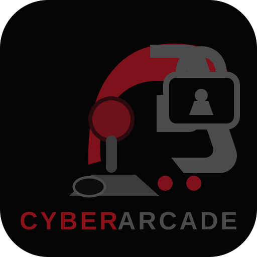<br/>
      <b>Mohammed Ahmed</b><br/>
      <sub>Lead Developer & Architect</sub><br/>
      <a href="https://github.com/Mido-ahmed586">@Mido-ahmed586</a>
    </td>
    <td align="center">
      <br/>
      <b>Contributors</b><br/>
      <sub>Project Contributors</sub><br/>
      <a href="https://github.com/Mido-ahmed586/cyberarcade/graphs/contributors">View all</a>
    </td>
  </tr>
</table>

---

## Acknowledgements

- [Apache Guacamole](https://guacamole.apache.org/) — Browser-based remote desktop gateway
- [Metasploit Framework](https://www.metasploit.com/) — Penetration testing framework used in lab scenarios
- [Kali Linux](https://www.kali.org/) — Security-focused Linux distribution powering attacker containers
- [Metasploitable2](https://sourceforge.net/projects/metasploitable/) — Intentionally vulnerable target VM
- [FastAPI](https://fastapi.tiangolo.com/) — Modern, fast Python web framework
- [SQLAlchemy](https://www.sqlalchemy.org/) — Python SQL toolkit and ORM

---

## License

CyberArcade is released under the **MIT License**.

```
MIT License

Copyright (c) 2025 Mohammed Ahmed

Permission is hereby granted, free of charge, to any person obtaining a copy
of this software and associated documentation files (the "Software"), to deal
in the Software without restriction, including without limitation the rights
to use, copy, modify, merge, publish, distribute, sublicense, and/or sell
copies of the Software, and to permit persons to whom the Software is
furnished to do so, subject to the following conditions:

The above copyright notice and this permission notice shall be included in all
copies or substantial portions of the Software.

THE SOFTWARE IS PROVIDED "AS IS", WITHOUT WARRANTY OF ANY KIND, EXPRESS OR
IMPLIED, INCLUDING BUT NOT LIMITED TO THE WARRANTIES OF MERCHANTABILITY,
FITNESS FOR A PARTICULAR PURPOSE AND NONINFRINGEMENT.
```

See [LICENSE](LICENSE) for the full license text.

> **Why MIT?** MIT is the most permissive widely-used license. It allows anyone to use, modify, and distribute CyberArcade — including commercial use — while requiring only that the copyright notice is preserved. This maximises adoption in academic institutions and encourages enterprise contribution.

---

<div align="center">

**Built for the cybersecurity community.**

If CyberArcade helped you learn, consider giving it a star.

[](https://github.com/Mido-ahmed586/cyberarcade)

</div>
